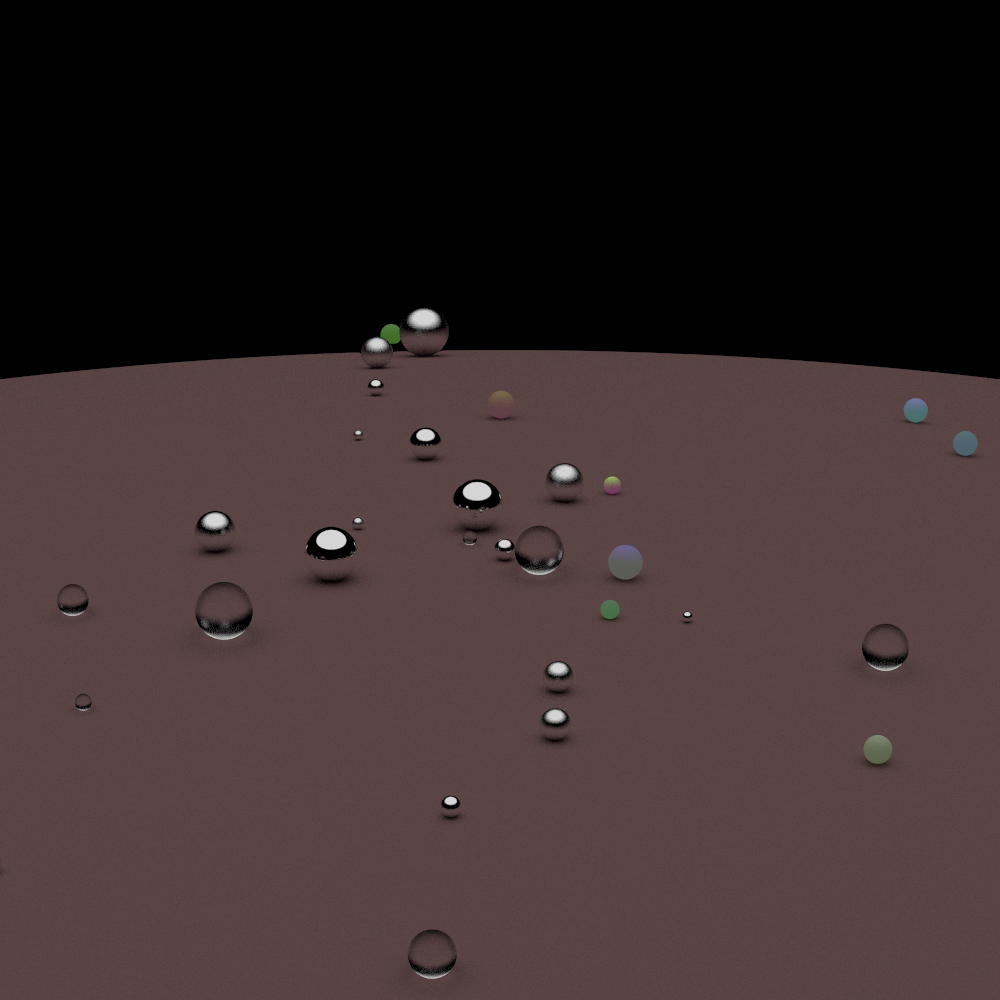
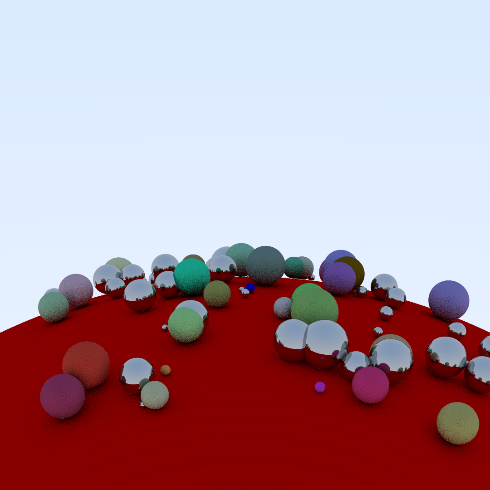

# Pathtracer demo

This is a demo project exploring pathtracing. Has support for metallic, dielectric and lambertian materials.

## Examples

Found in render/

### Balls


### Pretty


## How to run

- Building requires cmake

1.
```
cmake -B build
```

2.
Open the project then build and run.

